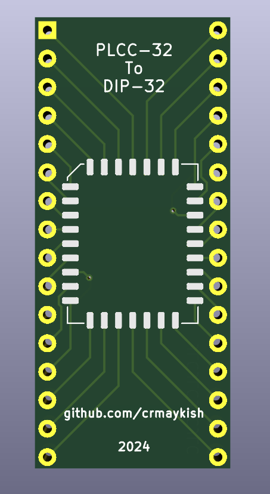
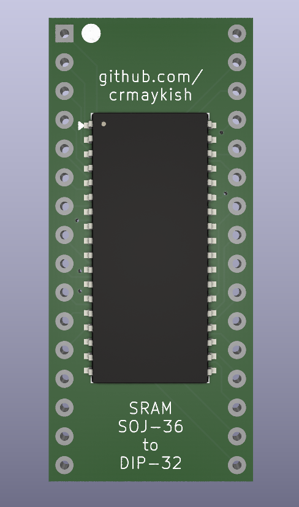
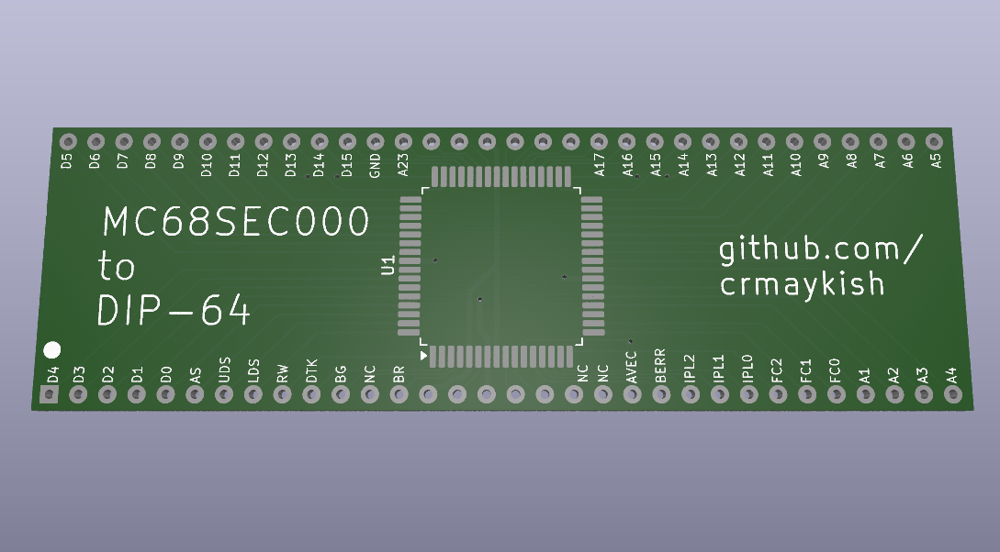

# Adapters and Breakout Boards

Here's a collection of various adapter PCBs I've made. Hopefully you find some of them useful. All design is done in KiCAD and Gerbers are provided.

## DIP Adapters

Adapters that convert surface-mount footprints to DIP

[1. PLCC-32 to DIP-32](PLCC-32-to-DIP-32/)

[2. SOJ-36 to DIP-32 SRAM](SOJ-36-to-DIP-32-SRAM/)

Converts 512KB SRAM chips from SOJ to DIP. Note: the address and data pins are scrambled to facilitate routing, but this is transparent to the connecting devices.

## Specialty Adapters

Specific and/or odd use case adapters

[1. MC68SEC000-to-DIP-64](MC68SEC000-to-DIP-64/)

Breaks out a 64 pin 68SEC000 CPU into a DIP-64 footprint mostly compatible with the full size 68000/68010. If the two jumpers are closed, this will run in 8 bit mode and connect the A0 line to where the E pin would normally be on a full size 68000. Leave the jumpers open to use this as a drop-in replacement.

